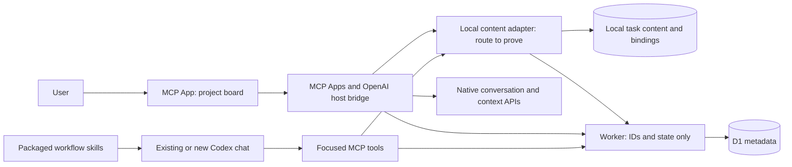

# Threadboard — Architecture

Status: implementation proposal · 3 October 2026

This document implements the intent in [VISION.md](./VISION.md). No application code exists yet. Proposed components and performance numbers below are design decisions and targets; platform facts are linked to their sources. Task content stays local. The user has approved hosting only IDs and state metadata, with the US$5/month Workers plan as the initial baseline.

[PUBLISHING_RESEARCH.md](./PUBLISHING_RESEARCH.md) records distribution evidence, installation steps, the revised cost plan, and unresolved native/local-storage/directory gates. Approval to consider the paid plan is not a purchase or deployment; none has occurred.

## 1. System boundaries

Use one TypeScript codebase with a local content adapter and a hosted metadata service. Local durable storage is authoritative for task text and native project/chat bindings. A Cloudflare Worker and D1 database are authoritative for task states, claims, run reservations, and metadata revisions. The UI joins the two by opaque board/task/run IDs. Codex remains the sole owner of actual chats.



The plugin owns task data and coordination. Codex owns chats, model execution, repository access, worktrees, permissions, and code review. Threadboard never reads, reconstructs, copies, or synchronizes chat transcripts, reasoning, or raw tool output. Opening a chat uses a locally stored native reference.

Different chats may connect to different local adapter processes. They share local content storage. Claims and state transitions use conditional hosted database writes, never process memory or a cached local state projection. A cloud snapshot alone cannot reconstruct task content on another machine.

For a bundled adapter, its working directory is the installed plugin directory, not necessarily the user's project. Resolve project association from supported host context or explicit setup, never from `process.cwd()` alone. The local MCP example demonstrates repository distribution of bundled code; it does not prove the directory can install that code alongside a hosted MCP connection. [Bits & Bolts](https://github.com/openai/mcp-extensions/blob/main/plugins/bits-and-bolts/README.md), [directory server limit](https://developers.openai.com/plugins/deploy/submission).

The local adapter's availability is a gate, not an established host API. Candidate routes are host-mediated resources for explicitly opened local board files, or a supported bundled local adapter. A browser cache or widget state is not a substitute for shared durable local content across chats.

## 2. Technology and package shape

| Component | Proposal | Reason |
| --- | --- | --- |
| UI | React, TypeScript, CSS using host style variables | A compact interactive board with familiar styling |
| Build | Vite or esbuild; a self-contained HTML UI resource | Reproducible bundles with no runtime asset-install step |
| Contracts | Shared Zod schemas | Validate tool inputs and outputs at each boundary |
| Host integration | MCP Apps plus `@openai/mcp-extensions` | Supported sidebar, conversation, context, and message interfaces |
| Hosted service | Cloudflare Worker, production HTTPS MCP and metadata API | Standard remote submission transport with small bounded requests |
| Hosted storage | D1, migrations, indexed queries, conditional writes | IDs, state, ownership, and revisions only |
| Local adapter | Bundled Node stdio MCP for repository installation; host-resource alternative to prove for directory installation | Shared task content without uploading it |
| Local storage | SQLite/WAL for the bundled adapter; versioned local-file adapter only if its host route is proved | Durable content, bindings, drafts, and recovery |
| Scope and access | OS-user local store plus authenticated remote tenant | Isolate boards between users; keep native names/paths local |
| Distribution | Repository package plus remote-MCP directory submission | Both channels must deliver the intended local-content workflow |

Keep dependencies pinned in a lockfile. At drafting time, the published OpenAI extensions package declares MCP SDK 1.x and MCP Apps 1.x peers, while MCP Apps also has a 2.x release. Select and test a compatible set rather than combining their latest major versions indiscriminately. [TypeScript SDK](https://github.com/openai/mcp-extensions/blob/main/typescript/README.md).

Suggested source layout:

```text
apps/board/                 UI and host bridge adapter
apps/mcp/                   Local adapter and tool registration
apps/worker/                HTTPS MCP, authenticated metadata API, D1 access
packages/contracts/        Separate local-content and remote-metadata schemas
packages/core/             Task transitions, claims, dependencies, and launches
packages/storage/          Local content storage and D1 metadata repositories
plugins/threadboard/       Manifests, skills, icons, and release metadata
tests/                     Protocol, concurrency, UI, and performance checks
```

Keep transport, persistence, and native host APIs outside core logic. Define separate `LocalContentStore` and `MetadataStore` interfaces; never serialize a joined task object to the Worker. Resolve the supported local adapter in the integration proof before committing to its storage format. For SQLite, choose a runtime/driver that ships without users compiling native dependencies.

For the repository adapter proof, use the supported Codex compatibility layout from the official local example. The recommended portable root-manifest format can follow once its transport is validated in the target host. Bundle application dependencies and UI assets; users must not run `npm install` or a frontend build. A bundled Node adapter uses a freely installed runtime, with GUI runtime discovery verified during installation testing. A proved host-resource-only route may avoid that runtime prerequisite. The installed cache contains application code; writable data lives elsewhere. [Packaging guide](https://developers.openai.com/plugins/build/plugins).

For the bundled adapter, Node 24's built-in SQLite module is a candidate for avoiding a separately compiled addon. It currently has release-candidate status; pin and test the chosen runtime version before adopting it. No separately shipped Threadboard native desktop app is part of the MVP. [Node SQLite](https://nodejs.org/download/release/latest-v24.x/docs/api/sqlite.html).

## 3. Native integration: established surfaces and release gates

The documented extension metadata supports global sidebar, thread-tab, and file entrypoints. The SDK exposes model context, messages, resources, and local file opening when the host advertises those capabilities. The Bits & Bolts example explicitly describes Codex sidebar and file-viewer integration. [Extension specification](https://github.com/openai/mcp-extensions/blob/main/docs/spec.md), [Bits & Bolts](https://github.com/openai/mcp-extensions/blob/main/plugins/bits-and-bolts/README.md).

For the MVP, register global and thread entrypoints on the board UI resource. The global workspace provides an explicit project switcher. A project conversation should open directly to its associated board after binding has been established.

Put native behavior behind a narrow `HostAdapter`:

```ts
interface HostAdapter {
  capabilities(): HostCapabilities;
  resolveProject(): Promise<ProjectBinding | null>;
  shareTask(task: TaskContext): Promise<void>;
  launchTask(request: LaunchRequest): Promise<LaunchReceipt>;
  openThread(reference: ThreadReference): Promise<void>;
}
```

This is our proposed interface, not an API supplied by OpenAI. `resolveProject`, project-bound `launchTask`, launch receipts, and opening links from the MCP iframe require implementation evidence from the host.

The documented `ui/message` extension can target a new conversation, but its schema does not expose a project selector or promise a returned native thread ID. Construct the task prompt locally and send it directly to the Codex host; the Worker must not receive it. A plugin deep link navigates within the plugin; that alone does not prove native chat navigation. [Message and deep-link specification](https://github.com/openai/mcp-extensions/blob/main/docs/spec.md#uimessage-extensions).

Separate desktop commands documentation supplies `codex://threads/<thread-id>` for chat navigation and `codex://threads/new?path=...&prompt=...` for a new local workspace chat. The latter pre-fills the composer without sending. These provide a candidate launch/navigation implementation, subject to supported bridge link opening and reliable identity. They do not select a unique saved project ID or establish automatic task execution. Do not silently replace Start's intended behavior with this fallback. [Desktop chat links](https://learn.chatgpt.com/docs/reference/commands#chats).

Thread entrypoints receive empty tool arguments, so native placement alone does not resolve the active project. A separate app-server client can create threads with a working directory, but that development API is experimental and does not establish saved-project placement in the desktop app. It is not a proven substitute for native host launch. [App-server maturity](https://learn.chatgpt.com/docs/developer-commands#codex-app-server).

OpenAI documents host-mediated reading and writing of an explicitly opened local file through opaque resource URIs, including conditional writes using an ETag. That may support a local board-file adapter. It does not establish arbitrary access to our SQLite store, automatic project-file discovery, or durable access from every sidebar/chat panel. Tool calls from a file entrypoint can also receive the absolute file path as host-added metadata; that behavior must be audited before any such call goes to the Worker. Keep task text out of remote tool arguments, results, widget persistence, settings, and typeahead queries. [Local file resources](https://github.com/openai/mcp-extensions/blob/main/docs/spec.md#file-extension-entrypoint).

Directory submissions currently connect only one MCP server per plugin. A working hosted endpoint does not prove that a companion local stdio server will be installed. Prove a supported local-content route or get explicit confirmation of the required companion mechanism before claiming a complete directory product. [Submission limit](https://developers.openai.com/plugins/deploy/submission).

Before expanding the implementation, prove these cases in an installed prototype:

1. Recover or explicitly establish the current native project association.
2. Launch a card into a new chat in that same project, including its intended execution environment.
3. Associate the resulting chat with the task and open it again from the card.
4. Resolve the same board from another chat and a worktree belonging to that project.
5. Repeat the flows using the installed marketplace copy, after restarting Codex and updating the plugin package.
6. Load and edit the same local task content from two chats and the sidebar while the hosted service receives only permitted metadata.
7. Demonstrate the local-content route for the directory installation, including reconnection and preservation after update; record any separately required component.
8. Inspect all requests and hosted logs with distinctive task/chat text sentinels, including file-entrypoint metadata, errors, settings, and UI state persistence.

Use supported host APIs and capability detection. The Codex app-management tools available to this development chat are not evidence that an installed third-party plugin can call them. If a supported project-bound launch route is unavailable, that is a product blocker to resolve or an explicit scope change to agree, not a completed Start feature.

## 4. Project identity and local scope

A board is associated with a stable opaque board ID in local storage. Bind that ID to a native Codex project ID where the host makes one available through a supported interface. Native IDs, project names, canonical roots, and explicitly associated worktree paths remain local. The service sees an opaque board ID scoped to an authenticated tenant.

Initial setup can establish the association explicitly. A directory picker or model-supplied path does not by itself identify a saved native project: require an unambiguous binding and keep its name visible. A project-local association file is an optional setup technique to validate, not a requirement to write into every repository.

Worktrees inherit the explicit project binding. Canonical Git metadata can help resolve a worktree to an existing binding during setup, but repository identity alone must not collapse distinct saved Codex projects. A project's basename or the server process's working directory is insufficient evidence.

Every tool call names its project or board explicitly. Never keep one server-wide `currentProject` variable: simultaneous chats would overwrite each other's context. UI selection is scoped to that UI instance.

The local adapter validates project/content associations. The Worker derives the tenant from a verified access token and validates that every board, task, run, and dependency belongs to that tenant. A board ID or owner reference is not authentication. Use opaque owner references remotely and resolve them to native chat IDs locally. OAuth/connection design must satisfy OpenAI's public-server requirements; it is now a required part of the release proof, with no paid auth provider assumed.

A trusted, bundled `SessionStart` hook may assist with session/project context if the host does not provide it through the UI bridge. Hooks require explicit host trust review. The core can accept an explicit binding without a hook; whether that fallback meets native chat identity requirements must be proved in the prototype. Do not read transcripts or assume a hook's session ID is a supported chat-navigation reference. [Hook documentation](https://learn.chatgpt.com/docs/hooks).

## 5. Data model

Separate storage by purpose:

| Location | Allowed data |
| --- | --- |
| Local only | Project names/paths/native IDs; task titles, descriptions, acceptance criteria, priority, blocked explanations, comments, result summaries, validation notes; native chat links; content versions and drafts |
| Hosted metadata | Opaque tenant/board/task/run/owner/operation IDs; workflow/run state; dependency ID links; order/rank; revisions, timestamps, reservation expiry, archive flags, and fixed event/error codes |
| Codex only | Actual messages, transcripts, reasoning, raw tool output, and conversation history; Threadboard does not maintain a copy |

Authentication records are separate from board metadata. Minimize identity fields and keep tokens out of logs. No hosted column, tool parameter, generic JSON blob, or analytics property may hold task/chat text. Do not upload encrypted copies or content hashes as a substitute for keeping content local.

An illustrative hosted record is:

```json
{
  "boardId": "6e1e43cf-dca0-4ec4-bcbf-a950ed787443",
  "taskId": "1772e0a7-a2fc-4e67-8b68-0df81a093fe7",
  "state": "in_progress",
  "ownerRef": "d66b711c-fac6-4d47-97fc-1780d55f51af",
  "version": 8
}
```

The following entities are conceptual joined views; their fields are persisted only in the permitted store:

| Entity | Essential fields |
| --- | --- |
| Project | `id`, `name`, supported host binding, canonical roots, default board |
| Board | `id`, `project_id`, monotonic `revision`, next task number |
| Task | `id`, board-local short ID, `board_id`, title, description, acceptance criteria, priority, status, rank, `version`, timestamps, archive flag |
| Task dependency | `task_id`, `prerequisite_id`; same board only |
| Task run | `id`, `task_id`, state, thread reference, claim identity, launch reservation, expiry, timestamps |
| Task event | `id`, `board_id`, `task_id`, board revision, opaque actor, fixed event kind; any free-form note stays local |

Statuses are `backlog`, `ready`, `in_progress`, `review`, and `done`. A blocked reason is separate from status. Run states are `launching`, `running`, `submitted`, `released`, and `failed`.

Use UUIDs for durable identifiers and a board-local sequence for readable IDs such as `TB-42`. Store timestamps in UTC and display them using the user's locale. Task text and project labels are untrusted content.

Index active tasks by board and status/rank, activity by board/revision, and runs by task/state. Enforce one active run per task using a partial unique index over `launching` and `running`. Dependency validation rejects cross-board links and cycles.

Hosted state mutations, their metadata events, and revision changes must be atomic and conditional on current state/version. Use D1's documented atomic batches and guarded SQL; verify zero-row compare-and-swap failures cannot create a run or event. Local SQLite content edits use WAL, foreign keys, a bounded busy timeout, and short write transactions across adapter processes. Do not assume D1 supports SQLite's local transaction-control API. [D1 batches](https://developers.cloudflare.com/d1/worker-api/d1-database/#batch).

There is no transaction spanning local storage and D1. Persist a local operation intent before a multi-step action, give remote steps idempotency keys, and record their receipts. Create task content locally before registering its ID remotely. An interrupted registration remains a recoverable local draft. A committed remote state change remains authoritative even if the local cache update fails; reconcile on the next explicit refresh. Never silently report both steps as saved when one failed.

## 6. Coordination and launch lifecycle

### Existing chat claims a task

The chat resolves its project binding and reads task content locally. It calls `claim_task` with a stable attempt ID and opaque owner reference. A hosted conditional operation checks metadata version, prerequisites, status, and existing active run. Exactly one claim succeeds. Repeating the same successful attempt returns the same run; another claimant receives the current owner reference and a conflict. The native chat ID is mapped locally, not sent as task content.

Progress and submission require the active run's claim handle. The user can explicitly release or reassign it. Generic task edits cannot bypass claim rules or fabricate a running chat. OS-user access is the local content trust boundary; verified tenant access is the hosted metadata boundary. Claim handles coordinate work within that authenticated scope.

### User starts a new chat

1. `prepare_task_launch` reserves an eligible task remotely and returns only run/operation IDs and expiry. The local adapter builds the bounded task prompt from local content.
2. The UI invokes the supported native launch operation once, using the established project binding.
3. The new chat binds itself to the reserved run before performing task work.
4. The local adapter records the verified native thread reference. The Worker records its opaque owner reference, marks the run running, and moves the task to In progress.

Launch state is distinct from work state. A reservation or an accepted message request is not proof that a chat exists or has begun execution.

Preparing a reservation is idempotent; the host's new-chat operation cannot be assumed to be idempotent. If its outcome is unknown, show a pending/uncertain launch and reconcile using supported host evidence or an arriving run binding. Do not automatically launch another chat. Expired unbound reservations become recoverable failures; a late binding must reconcile explicitly with any newer run.

Running claims do not expire just because a chat is quiet or the board is hidden. Interrupted tasks retain their ownership and an actionable state. Stale ownership requires explicit release or recovery, avoiding two chats silently doing the same task.

### Review and completion

The owner saves its deliberately written result summary and validation evidence locally, then submits an IDs/state-only transition to Review. Raw conversation/tool output is not copied. The user can accept it into Done or request changes. User-requested completion through a chat remains possible; the skill must distinguish that instruction from an executing agent deciding its own work is accepted.

Prerequisite links influence eligibility. Completing a prerequisite updates blocked indicators; it does not start dependent work automatically.

## 7. MCP tool surface and model context

Use focused tools with explicit schemas and read/write/destructive annotations:

| Tool | Responsibility |
| --- | --- |
| `open_project_board` | Render the associated board inside the host |
| `create_project_board` | Establish a local project binding and its default board |
| `list_project_boards` | Return a bounded list of the user's project boards |
| `get_board` | Return paginated summaries or a revision delta |
| `get_task` | Fetch a task's full details and bounded activity |
| `create_task` | Add a task with an idempotency key |
| `update_task` | Edit or move a task using its expected version |
| `link_task_dependency` | Add or remove an explicit prerequisite |
| `claim_task` | Atomically claim work in an existing chat |
| `prepare_task_launch` | Reserve work for a new native chat |
| `bind_task_run` | Associate a valid launch reservation with the resulting chat |
| `release_task` | Explicitly release ownership |
| `report_task_progress` | Add a concise progress note for the active run |
| `submit_task` | Record the result and move work to Review |
| `archive_task` | Archive or restore a task without losing its history |

Ordinary data tools return structured results without remounting the UI. The render tool owns the UI resource. UI actions use the host's MCP bridge rather than implementing another public mutation API.

The table describes the complete local-facing workflow. Hosted tools expose metadata operations only: `get_board_state`, `get_task_state`, guarded state/claim/run mutations, and the static UI resource. Local `get_task`, text edits, progress notes, comments, and result submission must use the proved local adapter. A remote MCP call must never take a title, description, task prompt, comment, or result summary, even if the caller volunteers one. The directory workflow must prove model access to local content as well as UI access; silently falling back to storing text remotely is unacceptable.

Construct outbound messages from strict metadata schemas, validate ID formats and state enums, and reject unknown properties both before transmission and at the Worker. Do not forward local tool arguments, joined task objects, host context, or file paths wholesale. Do not echo rejected payloads into errors or logs. Negative tests must include deliberate attempts to send task text through every hosted tool.

The packaged skill teaches project resolution, claim-before-work, concise progress, submission with evidence, and conflict handling. It remains bounded by the user's request; installation does not authorize chats to start arbitrary backlog tasks.

Share the selected task through `ui/update-model-context`. Include its ID, project/board reference, goal, acceptance criteria, and active run when relevant. Cap the default context at approximately 1,500 tokens; use `get_task` for longer details. Do not send whole boards or transcripts by default. [UI and context guidance](https://developers.openai.com/plugins/build/chatgpt-ui).

## 8. Refresh and failure handling

Local storage is authoritative for content; the Worker is authoritative for state. Accepted mutations return only the affected fields from their respective store. The UI applies a small optimistic update immediately, reconciles with the response, and restores its prior state if the mutation fails. Track local content versions separately from hosted metadata revisions.

Use revision-aware reads through `get_board`, with these refresh triggers:

- Opening or reopening the board, or selecting a different project.
- Pressing the explicit Refresh control.
- Completing a user-initiated board mutation, to reconcile any intervening changes from other chats.
- Recovering a lost host connection.

The MVP has no timer-based polling, WebSocket connection, push subscriptions, or background synchronization. A continuously open board can show an older snapshot until one of these triggers occurs. Display the time of the last successful board fetch; do not label the board as live or up to date merely because the connection is healthy. Edits preserve their drafts during refresh.

Unchanged revisions return a compact unchanged result. After initial loading, fetch metadata deltas and join them to local summaries; a gap outside retention triggers a fresh paginated metadata snapshot. Claims and state transitions check current hosted state, independently of UI freshness. Local edits check current local content versions. On conflict, fetch the affected record and preserve the user's intended edit for explicit reconciliation.

Keep at most one refresh request in flight per UI instance. Coalesce overlapping triggers; if a mutation commits after that read's snapshot, queue at most one follow-up refresh. Abort or discard responses after a project change. Tag cached data with its board ID, and sequence responses so an older snapshot cannot overwrite a newer mutation result. Failed reads keep the last successful snapshot and offer Retry; they do not start a polling loop.

Task details and events load on demand. Revision deltas carry summaries, not entire descriptions. Paginate old activity and archived tasks. Never silently drop or truncate tasks beyond the initial page.

Use typed errors for version conflicts, already-claimed tasks, unmet prerequisites, unavailable host capabilities, expired launches, storage contention, migration failure, and disconnected host transport. Failed edits preserve drafts. Connection banners distinguish cached data from confirmed fresh state.

When the hosted service is unavailable, allow reading local content and saving local drafts. Disable authoritative claims, launches, and state transitions until the connection returns; do not queue offline execution or claim that a task is running. Retrying an uncertain metadata write uses the same operation ID and checks its receipt. Missing local content is shown as unavailable; metadata-only records must not be presented as recoverable full tasks.

## 9. Performance budgets

These are initial release targets. Benchmark local storage, hosted queries, network/bridge latency, and host/model startup separately. Publish measured results rather than treating these numbers as evidence.

Reference workloads: 500 active tasks plus 5,000 archived tasks; a stress board with 2,000 active tasks; 20 simultaneous clients mutating different tasks; 100 concurrent claims for one task. UI measurements use a documented desktop/browser version and include a 4× CPU-throttled run. Server tests identify the hardware, runtime, database size, number of processes, and warm/cold state. Exercise both multiple clients on one server and multiple server processes sharing the database.

| Metric | Initial target |
| --- | --- |
| UI JavaScript and CSS | ≤250 KiB gzip combined; enforce at build time |
| First board data | ≤128 KiB uncompressed JSON for the first 200 card summaries; details excluded |
| First useful render | p95 ≤1 second after the host delivers initial tool data |
| Card selection and optimistic move | p95 ≤50 ms to visible feedback |
| Drag and scrolling | Smooth 60 Hz interaction; investigate plugin-caused long tasks above 50 ms |
| Local content reads | p95 ≤25 ms with 20 active callers, excluding host overhead |
| Local content write | p95 ≤50 ms with 20 active callers, including database contention |
| Hosted claim/state acknowledgement | p95 ≤1 second from the UI through the bridge and Worker; measure deployment region and network separately |
| Triggered board refresh | p95 ≤1 second for bounded local summaries plus hosted metadata; no deadline for external changes before a refresh trigger |
| Unchanged refresh | ≤1 KiB application payload, excluding transport framing |
| Open idle board | No periodic refresh requests, including while visible |
| Hidden board | No periodic refresh or animation work |
| Local server idle | No polling loops or permanent background daemon; measure RSS and process count in Codex |
| Model maintenance | No model calls for rendering, drag/drop, persistence, or refresh |
| Hosted refresh shape | One batched metadata request per refresh, not one per card; no task text in request/response |

Use stable card keys and memoized summaries. Window large columns, maintain a usable keyboard sequence, and virtualize activity separately. Load only the selected task's long text. Avoid rebuilding the whole board on each pointer movement or keystroke.

Local and hosted queries should be indexed and bounded. Measure cold starts and per-process memory independently; a lightweight process multiplied across chats can still be expensive. Set a measured release memory budget during the prototype. The MVP needs no Durable Objects, WebSockets, scheduled refresh jobs, or live-sync service. Requests occur only for actions and explicit refresh triggers.

Record latency histograms, fixed error codes, payload sizes, query counts, and hosted usage in benchmarks without task text or raw chat content. Performance regression and network-boundary checks belong in CI. Hosted logs contain operational counters/codes only, with no request bodies, prompts, paths, auth tokens, or local tool results. There is no content telemetry upload.

## 10. Local storage, privacy, and publication

For the bundled adapter, store `threadboard.sqlite` in a stable per-user application-data directory: `~/Library/Application Support/Threadboard/` on macOS, `%LOCALAPPDATA%/Threadboard/` on Windows, and `$XDG_DATA_HOME/threadboard/` or `~/.local/share/threadboard/` on Linux. A documented `THREADBOARD_DATA_DIR` override may select another local directory. SQLite/WAL requires a local filesystem. A host-resource alternative needs a documented local file format and equivalent conditional-write/recovery behavior; choose it only after the integration proof. Do not infer that hook-only `PLUGIN_DATA` variables are available to an MCP server.

Create private directories and files using supported OS permissions. Do not claim application-level encryption without implementing it. Sanitize rendered text, restrict UI network destinations, and never execute commands embedded in task text. Only the dedicated metadata client can contact our Worker with the allowlisted schema. Content intentionally shared with Codex goes directly to the host and follows normal chat processing; it must not pass through our service.

Provide local content export/backup and explicit deletion for both local content and hosted metadata. A D1 backup restores state metadata only. Back up live SQLite through a consistent snapshot, not by copying its main file while WAL writes continue. Package updates preserve data. Removing the plugin must not silently erase boards; document separate local and hosted deletion. Validate migrations and recovery in both stores.

| Channel | Release artifact and requirements |
| --- | --- |
| GitHub-backed marketplace | Public source, license, complete local adapter/UI package, remote service configuration, catalog, runtime/auth instructions, and clean-user installation |
| OpenAI universal directory | Production HTTPS MCP, supported local-content access, verified publisher/domain, required review materials, and accepted submission |

A public GitHub repository can supply a catalog that users add to supported local Codex clients. Confirm add/install/update behavior and authenticated metadata access in the target desktop version. Hook trust, if a hook is included, remains a user installation step. [Packaging guide](https://developers.openai.com/plugins/build/plugins).

The repository snapshot referenced by the catalog must contain the complete compiled package. Publishing a ZIP separately is insufficient if its source directory lacks server/UI assets. Use public repository hosting, local builds or standard public CI runners, and free static documentation. The approved infrastructure baseline is US$5/month for Workers, with D1 within its included allowances; usage overages and domain/auth decisions are separate. No separate model API billing is required. [Cost plan](./PUBLISHING_RESEARCH.md#7-cost-plan).

The hosted MCP addresses the standard HTTPS transport requirement. It does not waive publisher/domain verification, tool scans, review cases, privacy/support/terms pages, or acceptance. Current submissions exclude hooks/existing app references and connect only one MCP server per plugin. Resolve the local-content installation route; do not present a hosted metadata stub or skills-only listing as the complete board product. [Packaging guide](https://developers.openai.com/plugins/build/plugins), [submission guide](https://developers.openai.com/plugins/deploy/submission).

Secure MCP Tunnel explicitly does not support public plugin distribution. Do not use it to grant the Worker access to local task content. No directory listing-fee schedule or approval for our exact hybrid workflow has been established. [Tunnel boundary](https://developers.openai.com/api/docs/guides/secure-mcp-tunnels).

Publishing the repository/catalog is within our control once the product and release are ready. Default-directory placement requires external confirmation and acceptance. No package, marketplace listing, or directory submission has been published yet.

## 11. Delivery sequence and acceptance evidence

Before full application implementation, prove the mandatory distribution route, supported local-content bridge, and native workflow. The narrow integration proof is the next engineering milestone once these publishing constraints are understood; documentation alone does not count as proof.

1. **Integration and packaging proof:** demonstrate hosted IDs/state with shared local content, authenticated tenant isolation, network-boundary checks, native project resolution, new-chat launch, run binding, and navigation. Record host/runtime/capabilities and both installation routes. Resolve blockers before building around them.
2. **Shared board core:** implement separate local/metadata migrations, atomic claims, dependencies, version checks, idempotent operations, and split-store recovery. Exercise two clients and claim races.
3. **Polished interface:** build the board and detail panel, accessible interactions, model context, explicit refresh and freshness display, and conflict/reconnect handling.
4. **Performance and recovery:** measure the reference workloads, reconnects, duplicate requests, launch uncertainty, and interrupted chats. Fix budget regressions before release.
5. **Marketplace release:** package and test a stranger's installation through the GitHub-backed marketplace, including update and local data preservation. Publish install instructions, limitations, screenshots, license, and measured performance results.
6. **Directory placement:** submit the complete hybrid workflow through the production HTTPS route after its local-content mechanism is proved; report status independently of the repository release.

Required evidence includes actual Codex host tests, protocol/schema checks, database concurrency tests across processes, UI accessibility and recovery checks, and reproducible performance measurements. A browser preview alone does not prove native integration. Passing local tests alone does not establish universal-directory eligibility.

## 12. Decisions still open

- The supported method for selecting and confirming a native project during a new-chat launch.
- The supported source of native project/thread identity and the chat-navigation operation.
- The supported local-content bridge for directory installations, including shared access across chats, sidebar placement, and model access without sending text to the Worker.
- Authentication/connection design, domain verification, deployment region, and measured hosted usage.
- SQLite driver, minimum supported runtime, and reliable discovery of a freely installed runtime by the desktop host.
- Target OS versions, local data retention, backup behavior, and measured process-memory budget.
- Final product name, public repository, and publisher metadata.
- OpenAI's acceptance and any companion-installation requirements for this hosted-metadata/local-content plugin.

Native workflow and the local-content bridge are product feasibility gates. Runtime/auth packaging is an installation gate. Directory approval is a distribution gate. None permits uploading task content or chat history to our service.
