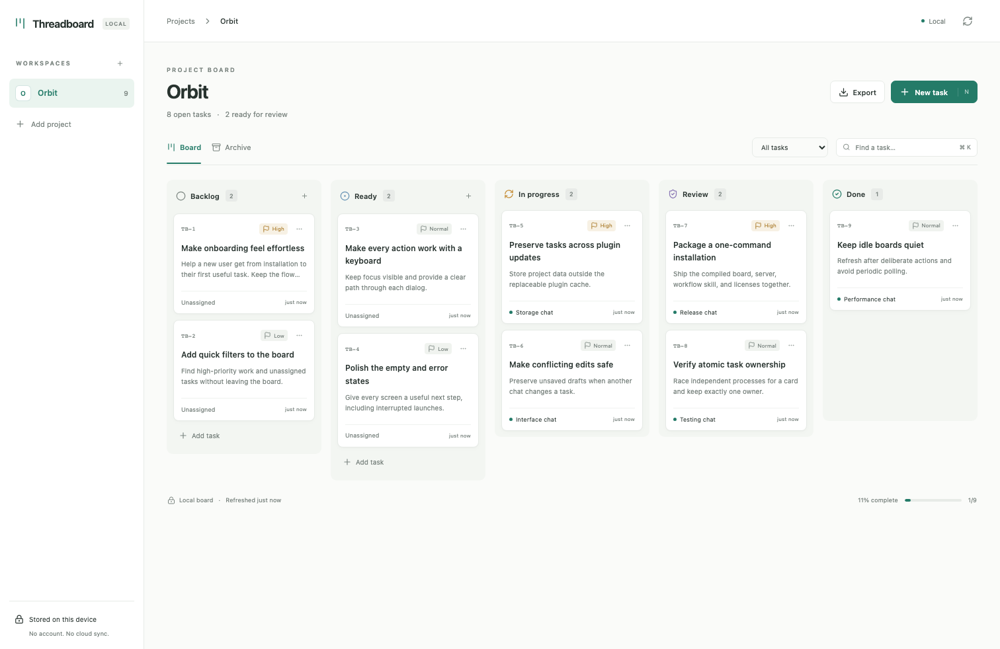

# Threadboard

A local project board beside your Codex chats. Plan work, give a task an owner, and bring the result back for review.

Threadboard is a Codex desktop plugin with a bundled MCP server and board interface. It has no hosted backend, account, cloud sync, telemetry, or separate model API bill. Your usual Codex usage still applies.

**Preview status:** browser workflows, packaged MCP execution, and clean CLI installation are tested. Native desktop entrypoints and new-chat links still need a real host smoke test. This preview is independently distributed and has not been submitted to OpenAI's universal directory.



## Install a release

You need a Codex desktop version that supports MCP Apps/plugin extension entrypoints, the Codex CLI on your PATH, and **Node.js 22.13 or newer**. Node 24 LTS or newer is recommended. The package contains compiled assets; npm and a build step are unnecessary.

1. Download `threadboard-0.1.1.zip` from [GitHub Releases](https://github.com/vrnrn/Threadboard/releases). Optionally verify it against the adjacent `SHA256SUMS` file.
2. Extract the archive. Open a terminal in the extracted `threadboard-0.1.1` directory.
3. Run:

   ```sh
   node install.mjs
   ```

4. Reopen Codex if it was already running. Find **Threadboard** in the installed plugins and open its board. You can also ask a chat, “Open my Threadboard board.”
5. Add a project with the same existing workspace directory that you use in Codex. Create your first task with a goal and acceptance criteria.

The installer verifies packaged files, copies the plugin to a stable application-data location, registers its local marketplace, and enables `threadboard@threadboard-plugins`. It pins a usable local Node executable so desktop startup does not depend on a terminal's PATH. It does not run npm, install a daemon, or open a network service.

For a repository marketplace instead of the downloadable installer:

```sh
codex plugin marketplace add vrnrn/Threadboard --ref v0.1.1
codex plugin add threadboard@threadboard-plugins
```

Repository installation uses `node` from Codex's PATH. Use the downloaded installer if the desktop cannot find Node. The repository marketplace is independently distributed; this release does **not** imply approval or listing in OpenAI's universal plugin directory.

## Use the board

The workflow is **Backlog → Ready → In progress → Review → Done**. Cards support descriptions, acceptance criteria, priorities, blocked reasons, prerequisites, activity notes, archiving and local JSON export. Use the card's move menu or the detail panel for keyboard-accessible moves; drag between columns with a pointer.

- **Existing chat:** Ask the chat to pick up a specified Threadboard card. The workflow skill reads the card, claims it atomically, reports concise progress, and submits it for review.
- **New chat:** Open a card and choose **Start in new chat**. A native Codex desktop link opens a workspace chat with a prefilled prompt. **Send the prompt** to bind the chat and start work. Preparing the link only reserves the task. It does not auto-send a message or guarantee placement in a particular saved Codex project.
- **Review:** Read the owner's result and validation. Choose **Accept into Done** or **Request changes**.
- **Other chats' changes:** Use **Refresh board**. The board reads on opening and after its own actions; it does not poll continuously.

Chat links use explicitly supplied native chat IDs. The plugin does not inspect transcripts. If a launch is interrupted, reopen its prepared link while the board remains open or copy its prompt. After reopening the board, release the old reservation and start again if its prompt is unavailable. Reservations expire for binding after 15 minutes and require explicit release to reuse the task. Quiet running chats keep ownership until submission or explicit release.

Shortcuts: **N** creates a task, **⌘/Ctrl K** focuses search, **Escape** closes a dialog. Search and filters apply to loaded cards; use **Load more tasks** for boards above 200 cards. Task detail displays the latest 50 activity events; export includes all events.

## Data and updates

Database location:

| Platform | Directory |
| --- | --- |
| macOS | `~/Library/Application Support/Threadboard` |
| Windows | `%LOCALAPPDATA%\Threadboard` |
| Linux | `$XDG_DATA_HOME/threadboard`, or `~/.local/share/threadboard` |

`THREADBOARD_DATA_DIR` can override the database location with an absolute path. The downloadable installer stores plugin files in a separate `marketplace` subdirectory under the default application-data directory. `THREADBOARD_INSTALL_DIR` can override that installation directory.

To update, download the new package and run its installer. It replaces only its marked installation directory; the database remains separate. If you upgrade or relocate Node and Codex can no longer start the plugin, rerun the installer. Repository users can refresh their marketplace and reinstall the newer plugin with the Codex CLI.

For a restorable database backup, stop Codex/plugin processes first, then copy `threadboard.sqlite` and any adjacent `threadboard.sqlite-wal` and `threadboard.sqlite-shm` files together. Restore the files only while the plugin is stopped. JSON export is a readable snapshot, with no JSON import in this release.

To uninstall:

```sh
codex plugin remove threadboard@threadboard-plugins
codex plugin marketplace remove threadboard-plugins
```

Uninstalling preserves task data. See [PRIVACY.md](PRIVACY.md) for what is stored and how task context reaches Codex when you choose to use it there.

## Development

```sh
npm ci
npm run typecheck
npm run build
npm test
npx playwright install chromium
npm run test:ui
npm run screenshots
npm run benchmark
npm run benchmark:startup
npm run benchmark:concurrency
npm run benchmark:populated
npm run benchmark:ui
npm run release:check
npm run release:pack
npm run test:install
```

`npm run dev` serves a development-only loopback preview at `http://127.0.0.1:4388`. Set `THREADBOARD_DATA_DIR` to an isolated absolute directory for sample data. This preview is not the user-facing installation.

The UI and stdio server are bundled, including licenses. The board loads no remote fonts, scripts or assets. Board reads return at most 200 summaries per page. The local benchmark checks 2,000 representative tasks against a 50 ms p95 read budget; UI JavaScript and CSS have a 250 KiB gzip budget. These are development budgets, not a latency guarantee on every machine.

`prototype.md` tracks the first release. `VISION.md` and `ARCHITECTURE.md` describe the longer-term product, including future architecture; they are not a description of every current feature. The design was inspired by [Cline Kanban](https://github.com/cline/kanban); this implementation is original.

MIT licensed. Bundled dependencies retain their own licenses in [THIRD_PARTY_NOTICES.md](THIRD_PARTY_NOTICES.md). Support and bug reports: [GitHub Issues](https://github.com/vrnrn/Threadboard/issues).
