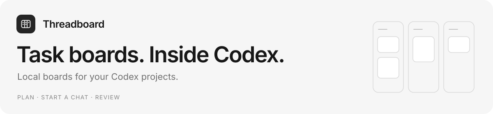
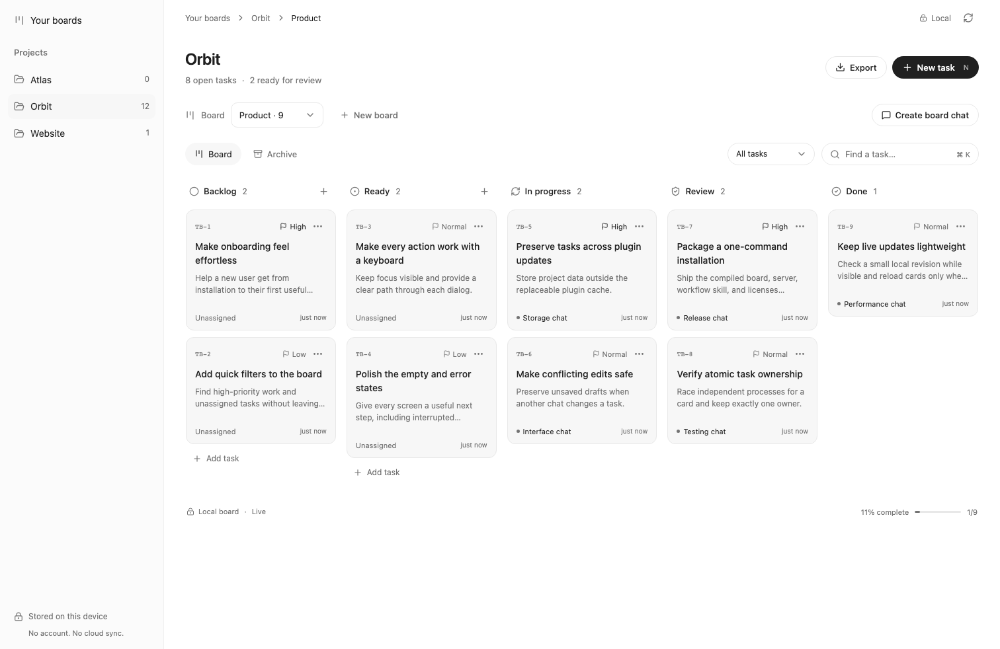
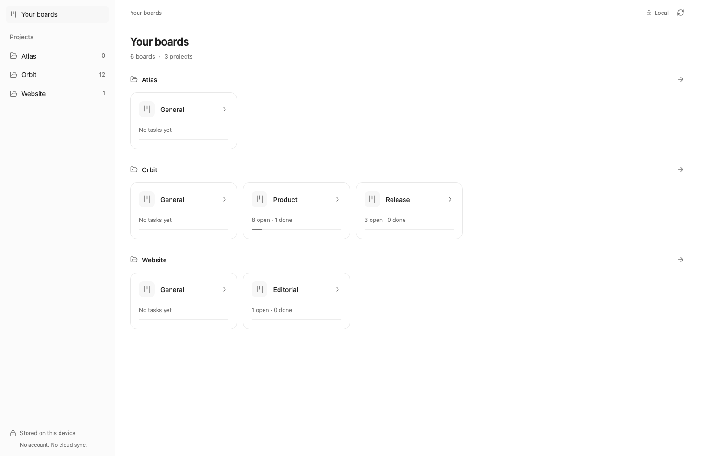
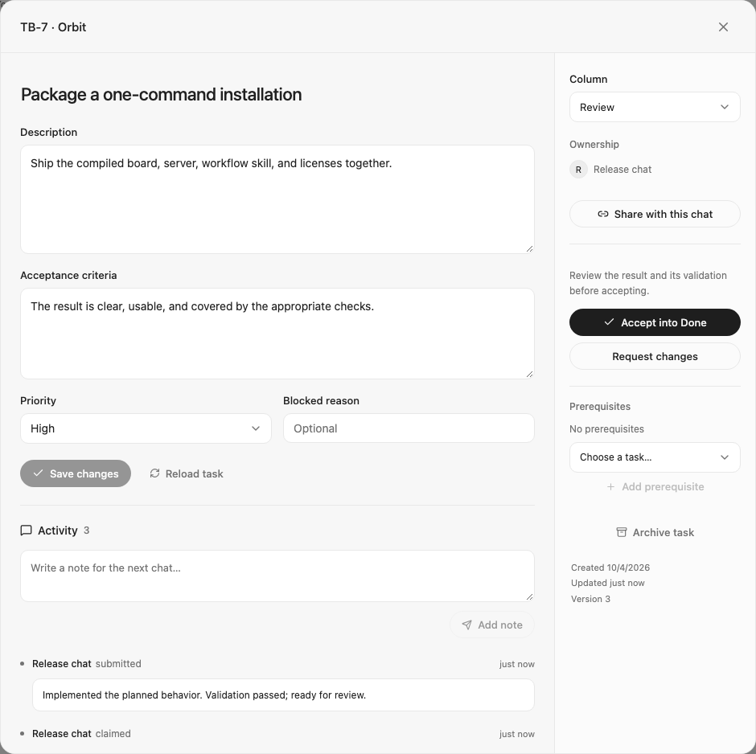

<picture>
  <source media="(prefers-color-scheme: dark)" srcset="docs/images/cover-dark.svg">
  
</picture>

Plan work across your Codex projects, give each task a chat, and bring the result back for review. Threadboard keeps your boards on your device and opens inside Codex.

**Current source preview: `0.1.4-dev.6`** · [Installation](#install-the-current-preview) · [User guide](docs/usage.md) · [Development](docs/development.md) · [MIT license](LICENSE)

<picture>
  <source media="(prefers-color-scheme: dark)" srcset="docs/images/board-dark.png">
  
</picture>

## From plan to review

- **Your Codex projects.** Existing local projects appear automatically, each with an empty General board. Create and manage projects in Codex.
- **Room for more than one board.** Organize a project into named boards such as Product, Release, and Editorial. The overview shows every board and its task counts.
- **Work shared across chats.** Pick up a card in an existing chat or start a new chat from it. Atomic ownership keeps one chat responsible for the work.
- **Results come back for review.** Read deliberate progress notes, review the result, and explicitly accept it into Done or request changes.
- **Lightweight live updates.** Visible boards check a small local revision once per second and reload only after changes. Hidden panels pause; open drafts are preserved.
- **A familiar surface.** The board follows Codex's theme and font settings, supports keyboard navigation, and adapts to narrower panels.

Task content stays in a local SQLite database. The plugin uses a bundled stdio MCP server, with no hosted backend or transcript synchronization. Using task information in Codex still uses your normal Codex account and model allowance. [Privacy details](PRIVACY.md).

<table>
  <tr>
    <td width="50%"><strong>Every project, every board</strong><br><br><picture><source media="(prefers-color-scheme: dark)" srcset="docs/images/overview-dark.png"></picture></td>
    <td width="50%"><strong>Review the work, then move it forward</strong><br><br><picture><source media="(prefers-color-scheme: dark)" srcset="docs/images/task-review-dark.png"></picture></td>
  </tr>
</table>

*Product captures use isolated demonstration data. [More screenshots and editable graphics](docs/graphics.md).*

## Install the current preview

You need a Codex desktop version with plugin/MCP App entrypoints, the Codex CLI, and **Node.js 22.13 or newer**.

```sh
codex plugin marketplace add vrnrn/Threadboard --ref main
codex plugin add threadboard@threadboard-plugins
```

Fully quit and reopen Codex, then open **Threadboard** from the sidebar. Your existing projects and boards appear in **Your boards**. Repository installation uses `node` from Codex's PATH; the source includes compiled assets, so consumers do not need npm or a build step.

### Install a release

The latest downloadable package is still [the `0.1.1` preview](https://github.com/vrnrn/Threadboard/releases/tag/v0.1.1). It uses manual workspace association and manual refresh; it predates the native project discovery, named boards, and live updates shown above.

Download its ZIP, extract it, and run `node install.mjs`. The installer discovers Node, verifies checksums, and keeps plugin files separate from task storage. Reopen Codex and follow that release's included README. Installing a newer package preserves task data.

## A few useful details

A new card chat opens with a prefilled prompt: **send it to begin**. Creating a named board can also request a companion chat named “<board name> Threadboard” through Codex's native project-aware tools. Threadboard stores the chat reference and deliberate task state, without reading conversation history.

If Codex leaves the board in a split pane after Back, **Open full view** beside Refresh requests the sidebar app and carries the selected project, board, and archive view. Codex owns its navigation and pane layout; this new recovery control still needs native-host verification.

Shortcuts: **N** creates a task, **⌘/Ctrl K** focuses search, and **Escape** closes a dialog. [The user guide](docs/usage.md) covers board navigation, claims, companion chats, exports, backups, and removal.

## Build and contribute

See [the development guide](docs/development.md) for local setup, tests, performance checks, packaging, and installation verification. Regenerate the current product captures and social artwork with `npm run graphics`.

Native board opening has been confirmed locally. The preview's browser workflows, packaged MCP execution, and clean installation are tested; card-launch project placement and the full-view recovery control have separate native-host checks remaining. Threadboard is independently distributed through its repository marketplace; it has not been submitted to OpenAI's universal directory.

The design was inspired by [Cline Kanban](https://github.com/cline/kanban); this implementation is original. [Release notes](RELEASE_NOTES.md) track shipped and source previews. [The vision](https://github.com/vrnrn/Threadboard/blob/main/VISION.md) and [architecture](https://github.com/vrnrn/Threadboard/blob/main/ARCHITECTURE.md) describe the longer-term product.

MIT licensed. Bundled dependencies retain their own licenses in [THIRD_PARTY_NOTICES.md](THIRD_PARTY_NOTICES.md). [Report a bug](https://github.com/vrnrn/Threadboard/issues).
